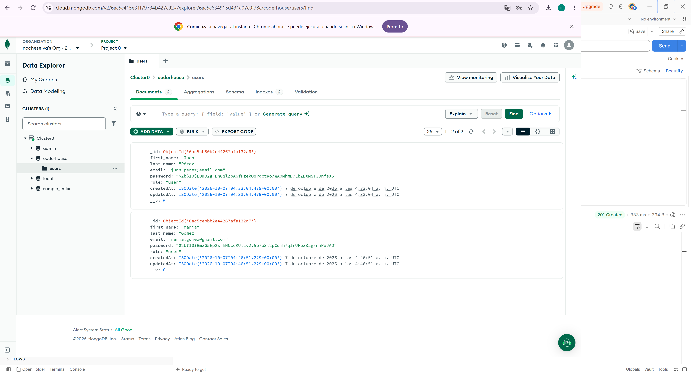

# 🎟️ Eventify - Plataforma de Eventos e Inscripciones

Base arquitectónica de una API REST desarrollada con Node.js y Express, estructurada bajo un patrón por capas orientada a escalabilidad.

## 🚀 Tecnologías utilizadas
* Node.js
* Express
* Mongoose / MongoDB
* Dotenv
* Nodemon (desarrollo)

## 📦 Instalación y Configuración

1. Clona el repositorio:
   ```bash
   git clone <url-de-tu-repositorio>


## 📸 Evidencias de Funcionamiento

### 1. Respuesta del Endpoint en Postman (201 Created)


### 2. Contraseña Hasheada en MongoDB Atlas
